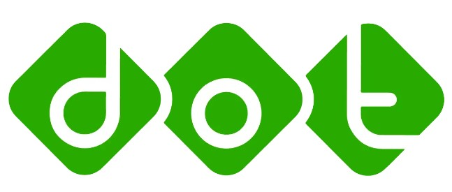

<h1 align="center">
  
  <br/>
  DOT Quiz Game [Frontend Challange]
</h1>

<p align="center">
 <a href="" target="blank" style="text-decoration: none;">
  
 </a>
 <a href="https://tailwindcss.com/docs/guides/vite#react" target="_blank" style="text-decoration: none;">
  
 </a>
 <a href="https://www.w3schools.com/js/" target="_blank" style="text-decoration: none;">
  
 </a> 
 <a href="https://react.dev/" target="_blank" style="text-decoration: none;">
  
 </a> 
 <a href="https://www.typescriptlang.org/" target="_blank" style="text-decoration: none;">
  
 </a> 
 <a href="https://nodejs.org/en" target="_blank" style="text-decoration: none;">
  
  </a> 
 <a href="https://vercel.com/" target="_blank" style="text-decoration: none;">
  
  </a> 
 <a href="https://github.com/" target="_blank" style="text-decoration: none;">
  
  </a> 
</p>

## Project

Description:
This project is a fullstack web application for a quiz game, built using React with TypeScript for the frontend and Express for the backend. The backend features a simple structure with a single table called history, which records player performance and game statistics. The application allows users to participate in quizzes, track their scores, and view a leaderboard displaying top players based on their scores and the number of questions answered. The project utilizes PostgreSQL as the database and is structured as a monorepo, allowing for organized management of both frontend and backend code.

## Setup

### Back-End

Go Inside Backend Folder by typing cd backend into terminal

#### 1. Node.js

To install all packages listed in your package.json file, use the following command:

```
npm install
```

#### 2. Download Requirement

Install Postgress and PGAdmin(Optional can use other DBMS)
[pgAdmin](https://www.pgadmin.org/download/) | [PostgreSQL Server](https://www.postgresql.org/download/)

#### 3. Setup Database Environment

To run this project, you need to add data to the .env file to connect to the database. An example of the contents of the .env file can be found in the .env-example.

```
DB_USERNAME=
DB_PASSWORD=
DB_NAME=
DB_PORT=
DB_HOST=
PORT=
```

#### 4. Setup Database

Do This Step For Database

```
npm run db-create
npm run db-migrate
npm run db-seed
```

#### 5. Start server

To run the server, you can use the following command:

```
npm run dev
```

### Front-End

Go Inside Frontend Folder by typing cd frontend into terminal

#### 1. Node.js

To install all packages listed in your package.json file, use the following command:

```
npm install
```

#### 2. Start server

To run the server, you can use the following command:

```
npm run dev
```

To See The Interface, You can use this route:

```
http://localhost:5173
```
